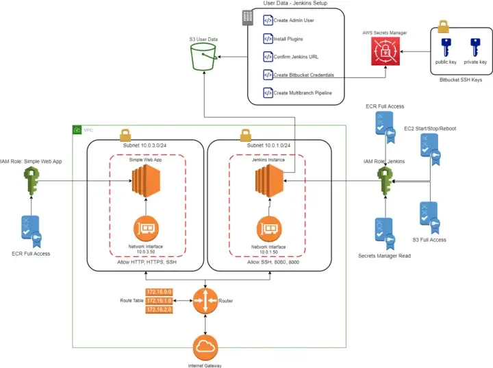
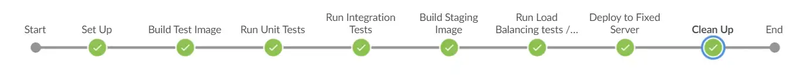
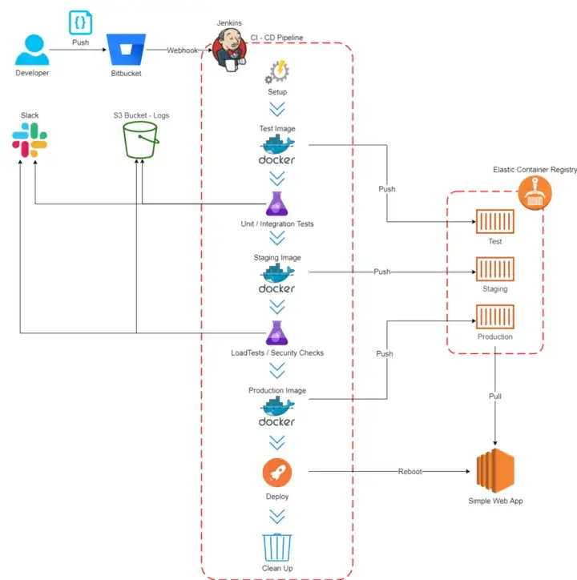

# devops-project
The CI/CD Pipeline and its infrastructure with AWS, Terraform, Docker, Jenkins and Bitbucket. The project has been created within DevOps course, Kyiv Polytechnic Institute, 2023

Implemention of a Continuous Integration / Continuous Deploy  (CI / CD) Pipeline to run on a push on the remote repository (Bitbucket) and go through various steps in which unit / integration / load balancing tests will be run alongside some security / vulnerability scans, while saving artifacts along the way with test results uploaded to an S3 bucket. Artifacts are saved in AWS Elastic Container Registry as Docker images.

All the infrastructure has been built with Terraform, implementing Infrastructure as Code (IaS).

The web app is served from an EC2 instance, in particular from a docker container which is pulled at boot time from a specific AWS Elastic Container Registry. The Jenkins server is hosted on its own EC2 instance. These two instances are supplemented with their own Elastic Network Interface under their own Subnet. A Router with a Route Table allows internal comunications and allows the Internet Gateway to correctly let external users communicate through the VPC with the instances. Since the Jenkins setup scripts is quite lengthy, it is uploaded to an S3 bucket and in the EC2 user data is pulled down and run. Also, the Bitbucket SSH keys has been uploaded to AWS Secret Manager.

AWS infrastructure build using Terraform:

Jenkins Pipeline Stages:

CI / CD Pipeline:

